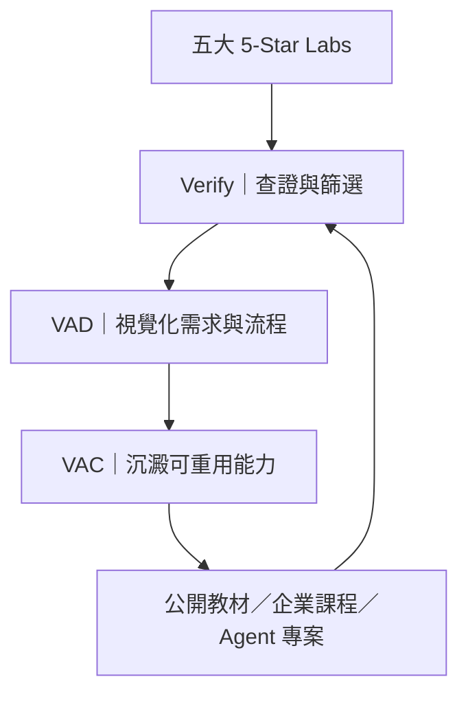

# Ai-to-Agent-5star-Labs

> **AI Coach 益力康陳董｜2026 AI to Agent**

[](#)
[](#)
[](#)
[](#)

**Ai-to-Agent-5star-Labs** 是一套面向公開教學、企業培訓與自主學習的 AI Agent 教材研究系統。它從五個高品質、可公開存取且持續更新的生態中，蒐集程式、模型、中文教材、實作案例與開發者真實問題，再透過 **Verify → VAD → VAC**，轉化成可教、可做、可驗收、可重用的課程能力。

本專案不是五個網址的收藏，也不是平台排名；它是一條把外部開源知識轉成企業內部能力的教材生產線。

---

## 一句話定義

> **用 GitHub 找程式與 Skill、Hugging Face 找模型與國際課程、ModelScope 看中文模型與 Agent 生態、Datawhale 建立系統化學習路徑、V2EX 找真實問題，再以 VAD／VAC 轉化成企業可重用的 AI to Agent 教材。**

## 為什麼需要 5-Star Labs？

Agent 時代的問題不再只是「資料不夠」，而是：

- 資訊更新太快，教材很快過期。
- Demo 很多，但缺少企業需求與驗收標準。
- 工具能跑，不代表能穩定、低成本地重複執行。
- 課程常教單一平台，學員離開平台後無法遷移能力。
- 企業真正需要保存的是 Know-how，而不是綁死某個模型或工具。

因此，本專案以五大 Labs 建立外部知識雷達，再透過方法論完成知識轉譯：



## 五大 Labs

| Lab | 核心角色 | 主要素材 | 教材轉化方向 |
|---|---|---|---|
| **GitHub Lab** | Code／Skill／Repo Lab | 原始碼、Agent Framework、MCP、Workflow、Issues、Release | 程式實作、架構拆解、版本治理、能力倉庫 |
| **Hugging Face Lab** | Model／Dataset／Course Lab | 模型、Dataset、Spaces、Agents Course、Benchmark | 模型選型、Agent 基礎、推論實驗、評測 |
| **ModelScope Lab** | 中文 Model／Agent Lab | 中文模型、Datasets、Studios、MCP、Agent Skills | 中文情境、在地模型、Agent 工具串接 |
| **Datawhale Lab** | Learning／Knowledge Lab | Hello-Agents、開源教材、範例程式、學習社群 | 系統課綱、原理教學、Multi-Agent 實作 |
| **V2EX Agent Lab** | Practice／Community Lab | 開發討論、踩坑、成本、部署、工具比較 | 問題導向教案、風險案例、實戰 QA |

### 1. GitHub Lab：找到可驗證的能力資產

GitHub 不只是程式碼倉庫，更是 Agent 能力的版本化場所。觀察重點包括：

- 專案是否持續更新、Release 是否清楚。
- README、Examples、Tests 與 Issues 是否完整。
- Skill、MCP、Workflow、Memory、Evaluation 如何組合。
- 授權條款是否允許教學、修改與再散布。
- 是否能把一次成功的做法固化成可重用 VAC。

**課堂任務範例：**選擇一個 Agent 專案，完成安裝、最小可行實驗、錯誤紀錄與驗收報告。

#### 2026 轉折：Cursor Origin 正面切入程式倉庫

Cursor 將 **Origin** 定位為 **「為 Agent 規模打造的 Git Forge」**。它從 AI 編輯器與 Coding Agent 出發，向上整合 Repository、Pull Request、Code Review 與 GitHub Sync；這條路線與 GitHub 從程式倉庫逐步加入 AI 的演化方向相反。

| 比較 | GitHub | Cursor Origin（Early Beta） |
|---|---|---|
| 出發點 | 人類工程協作與開源生態 | AI 編輯器與 Coding Agent 工作面 |
| 已有能力 | Repo、PR、Issues、Actions、Packages、Release、Marketplace | Repo、Git Push／Pull、程式瀏覽與搜尋、PR、GitHub Mirror、API／CLI |
| Agent 關係 | 在成熟平台上加入 Copilot 與 Coding Agent | Agent 與 Repo、PR 工作流原生相鄰 |
| 公開教材 | 支援 Public Repo，適合公開課程 | 目前官方建立流程僅列 Internal／Private |
| 生態成熟度 | 成熟且具大型開源網路效應 | 早期測試，功能與規則仍可能變動 |
| 現階段角色 | 公開教材的 Source of Truth | Agent-native 私有實驗與觀察平台 |

因此，本專案目前的判斷不是「Origin 已取代 GitHub」，而是：

> **GitHub 仍是公開教學與開源能力倉庫；Origin 是必須追蹤的 Agent-native Repository 新路線。**

Origin 暫不列為第六個 5-Star Lab，原因不是技術不重要，而是它仍在 Early Beta，且現階段不適合作為公開教材的主要發布地。完整分析請見 [`docs/origin-vs-github.md`](docs/origin-vs-github.md)。

### 2. Hugging Face Lab：理解模型如何變成 Agent 的大腦

Hugging Face 提供模型、資料集、Spaces 與完整 Agents Course，適合用來理解：

- Agent 的 Thought／Action／Observation 循環。
- Tool Use、Function Calling 與 Agentic RAG。
- smolagents、LangGraph、LlamaIndex 等框架差異。
- 模型能力、延遲、成本與任務難度的關係。
- Benchmark、Observability 與 Evaluation。

**課堂任務範例：**讓同一個任務分別使用低階與高階模型執行，比較成本、速度、錯誤率與人工修正次數。

### 3. ModelScope Lab：補足中文模型與 Agent 生態

ModelScope 的價值在於中文模型、資料集、Studio、MCP 與 Skills 生態，可作為國際模型資源之外的中文實驗場：

- 搜尋與比較中文模型及資料集。
- 觀察 Agent Skills、MCP 與模型平台的整合。
- 測試繁體中文、產業術語與在地情境表現。
- 評估模型部署、API、授權與企業採用成本。

**課堂任務範例：**以相同 VAC 比較國際模型與中文模型在繁體中文企業任務上的完成率。

### 4. Datawhale Lab：把技術整理成可學習的路徑

Datawhale 的 Hello-Agents 從 Agent 原理、ReAct、Plan-and-Solve、Reflection、低代碼平台，到 Memory、協議、評估與 Multi-Agent，具備完整中文學習脈絡。

本 Lab 關注的不只是「學了哪些章節」，而是：

- 哪些概念是 Agent 的長期基礎能力。
- 哪些範例適合新手、企業主管或工程團隊。
- 如何把章節內容重組為 1 小時、3 小時、6 小時或專案制課程。
- 如何把動手實作轉成具體驗收標準。

**課堂任務範例：**把一個 Agent 經典范式，用費曼學習法重新講給非工程背景的企業主管聽，並完成視覺流程圖。

### 5. V2EX Agent Lab：從真實問題反推課程需求

V2EX 的 AI Agent 智能體節點集中討論 Skills、MCP、Tool Use、Workflow、部署與模型選擇。它最重要的價值是呈現「實際做了以後發生什麼事」。

可觀察的問題包括：

- Agent 為何自作主張或長時間失控。
- 如何選模型、控制 Token 與 API 成本。
- 長時間運行、伺服器部署與權限隔離。
- 工具失敗、上下文污染與結果不可重現。
- 開發者真正願意採用或放棄某工具的理由。

**課堂任務範例：**選一則真實討論，將抱怨或踩坑改寫成「問題—原因—控制點—驗收」四段式案例。

## 五星評選標準

「5-Star」不是平台自稱，也不是單看流量。本專案使用六項條件定期複核：

| 構面 | 判斷問題 | 最低要求 |
|---|---|---|
| **存在性** | 官方頁面、Repo 或節點是否能正常存取？ | 可公開驗證 |
| **活躍度** | 近六個月是否有更新、Release 或新討論？ | 至少一項成立 |
| **Agent 關聯** | 是否直接涵蓋 Agent、Skill、MCP、Tool、Workflow 或 Evaluation？ | 高度相關 |
| **教材價值** | 是否具備可學習、可實作或可討論的材料？ | 可形成教案 |
| **可驗證性** | 是否能追溯來源、版本、程式或討論？ | 有原始連結 |
| **互補性** | 是否補足其他 Labs 沒有的角色？ | 定位不重複 |

完整評選與退出機制請見 [`docs/5star-selection.md`](docs/5star-selection.md)。

## Labs → Course 教材生產流程

### Step 1｜Scan：掃描

每週從五大 Labs 蒐集值得關注的新專案、模型、課程、Release、討論與踩坑。

### Step 2｜Verify：查證

確認官方來源、更新日期、授權、可重現性與 Agent 關聯；未通過查證的內容不進正式教材。

### Step 3｜VAD：Visual Agent Design

將複雜需求轉成人人看得懂的視覺介面：目標、輸入、步驟、工具、輸出、風險與驗收。

VAD 在本專案承擔三個功能：

1. **Visual Requirement Interface**：降低人與 Agent 的溝通成本。
2. **Reusable Task Specification**：讓成功任務可以被保存與複製。
3. **Cost-Aware Intelligence Routing**：已知任務交給合適的低階模型；未知或高風險任務才升級高階模型。

### Step 4｜VAC：Visual Agent Capability

把已驗證的成功方法，沉澱成 Agent 能讀懂、教師能教、企業能重用的能力單元。建議欄位：

- 目標與適用情境
- 輸入素材與資料限制
- 任務流程與工具
- 模型選擇與升級條件
- 輸出格式
- 驗收標準
- 失敗案例與修復方法
- 成本、時間與版本紀錄

### Step 5｜Teach：教學

把 VAC 轉成微課程、工作坊、企業案例、GitHub Lab 或 30 秒短影音工作流程。

### Step 6｜Evaluate：評估

至少記錄：完成率、時間、Token／API 成本、修改次數、錯誤率、初學者理解度、跨模型一致性與可重用率。

### Step 7｜Reuse：複利

通過驗收的 VAC 進入企業能力倉庫，後續可由不同模型、Agent 或工具重複執行。

## 建議課程架構

| 模組 | 學習成果 | Lab 來源 | 主要產出 |
|---|---|---|---|
| 1. Agent 時代與基礎 | 分辨 Chat、Workflow 與 Agent | Hugging Face、Datawhale | 概念圖與判斷題 |
| 2. 模型與工具選型 | 依任務選擇模型、Tools 與框架 | Hugging Face、ModelScope | 選型矩陣 |
| 3. 開源專案實作 | 安裝並驗證 Agent 專案 | GitHub | 實驗紀錄 |
| 4. 真實問題拆解 | 從踩坑建立控制點 | V2EX | 風險案例卡 |
| 5. VAD 工作坊 | 視覺化需求、流程與驗收 | 五大 Labs | VAD 任務圖 |
| 6. VAC 能力封裝 | 將成功方法變成可重用規格 | 五大 Labs | VAC 文件 |
| 7. AI to Agent 專案 | 跨模型執行並比較結果 | 五大 Labs | Agent 成果與評估表 |

更完整的 6 小時課程範本請見 [`docs/course-blueprint.md`](docs/course-blueprint.md)。

## 專案目錄

```text
Ai-to-Agent-5star-Labs/
├── README.md
├── LICENSE
├── CONTRIBUTING.md
├── docs/
│   ├── 5star-selection.md
│   ├── course-blueprint.md
│   └── origin-vs-github.md
├── labs/
│   └── 2026-08-30-datawhale-hello-agents.md
└── templates/
    └── lab-note.md
```

## 如何使用這個 Repo

### 教師／講師

1. 選擇一個 Lab 與一個具體主題。
2. 使用 [`templates/lab-note.md`](templates/lab-note.md) 建立實驗紀錄。
3. 補上官方來源、版本與授權。
4. 完成 VAD 流程與 VAC 能力規格。
5. 設計課堂任務與驗收量表。

### 企業主管

1. 先定義企業問題，不先綁定工具。
2. 從 Labs 尋找成熟能力與案例。
3. 以 VAD 對齊部門需求。
4. 用 VAC 保存成功 Know-how。
5. 用 Verify 與成本指標決定是否規模化。

### 自主學習者

1. 從 Datawhale 或 Hugging Face 建立基礎。
2. 到 GitHub 與 ModelScope 完成實作。
3. 到 V2EX 對照真實問題。
4. 留下自己的 Lab Note 與可重現步驟。

## 已確認的官方入口

本清單於 **2026-08-30** 核對存在性與 Agent 關聯；活躍度會隨時間改變，應依評選規則定期複核。

| Lab | 官方入口 | Agent 教材／社群入口 |
|---|---|---|
| GitHub | [GitHub](https://github.com/) | [GitHub Skills](https://skills.github.com/)／[MCP Registry](https://github.com/mcp) |
| Origin（觀察名單） | [Cursor Origin 文件](https://cursor.com/docs/origin/create-repository) | [Origin API](https://prod.cursor.com/docs/api/origin)／[官方發布討論](https://forum.cursor.com/t/origin-code-hosting/168670) |
| Hugging Face | [Hugging Face](https://huggingface.co/) | [Agents Course](https://huggingface.co/learn/agents-course/en/unit0/introduction)／[繁體中文課程](https://huggingface.tw/learn/agents-course/unit0/introduction) |
| ModelScope | [ModelScope](https://modelscope.cn/) | [ModelScope Skills](https://github.com/modelscope/modelscope-skills)／[社群聯絡](https://modelscope.cn/docs/community/contact-us) |
| Datawhale | [Datawhale](https://www.datawhale.cn/) | [Hello-Agents](https://github.com/datawhalechina/hello-agents)／[線上教材](https://datawhalechina.github.io/hello-agents/) |
| V2EX | [V2EX](https://www.v2ex.com/) | [AI Agent 智能體節點](https://www.v2ex.com/go/agent) |

## 治理原則

- **來源優先：**官方文件、原始 Repo 與原始討論優先於二手摘要。
- **版本意識：**每份 Lab Note 記錄查核日期、版本與環境。
- **不盲目追新：**熱門不等於適合企業導入。
- **不綁單一工具：**保留目標、流程與驗收，工具可以替換。
- **成本可見：**模型、Token、API、人工修正與維運成本都要記錄。
- **高風險升級：**未知、不可逆或高風險任務需要高階模型與人工核准。
- **能力複利：**成功方法轉為 VAC，讓下一次不必從零開始。

## 授權

本專案內容（README、docs、templates、labs 等文字教材）採用
[**CC BY-SA 4.0**](LICENSE)：可自由分享與改作，但須姓名標示，且衍生作品需以相同授權釋出。

引用之第三方程式、模型與教材，仍依其各自原始授權為準；本專案只做摘要、改寫與連結，不整段轉載原文。

## 品牌與作者

**AI Coach 益力康陳董｜2026 AI to Agent**

本方法論結合資工邏輯、企業經營與教學實戰，核心主張是：

> **Agent 可以替換、工具可以替換、模型可以替換；企業真正要留下的是經過驗證的能力規格與 Know-how。**

---

如果這個專案對你的教學或企業實作有幫助，歡迎 Star、提出 Issue，或依 [`CONTRIBUTING.md`](CONTRIBUTING.md) 分享可重現的 Lab Note。
